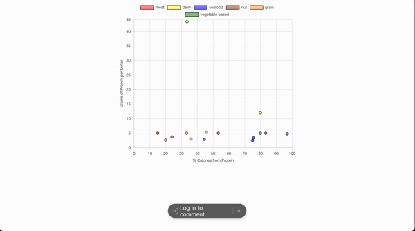

# Protein Comparison Chart
A simple chart.js demo written in TS and deployed to vercel. 

 

This is a purely client-side, single-page application (SPA) that uses chart.js to compare the composition of different protein sources.

